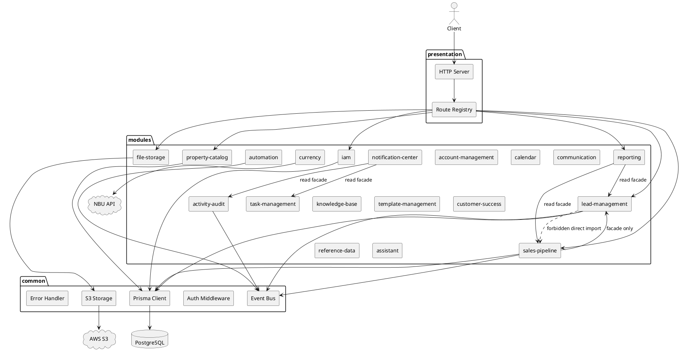
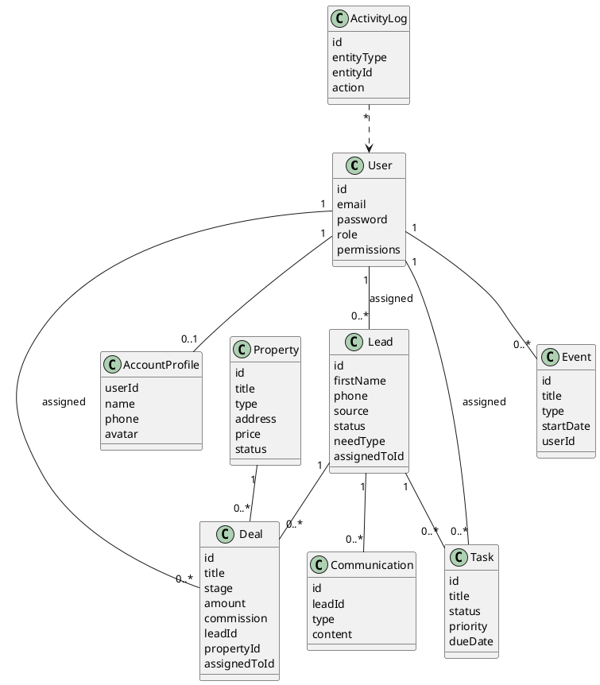
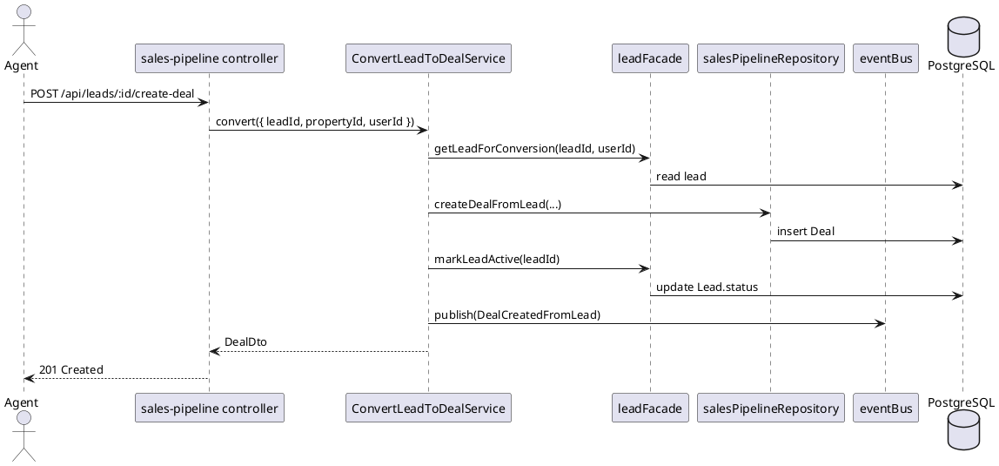
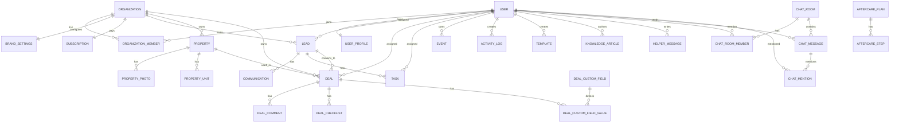

# Server Modular Monolith Architecture

Документ описывает целевое разбиение backend сервера CRM на модули по правилам из `Modular Monolit Doc.md`.
Текущий сервер содержит два слипшихся модуля: `iam` и большой `system`. Цель - убрать `system` как бизнес-монолит и заменить его независимыми bounded contexts с публичными контрактами.

## Архитектурные правила

1. Сервер остается одним backend-приложением и одним деплоем.
2. `presentation` монтирует HTTP API, но не содержит бизнес-логику и запросы к БД.
3. `modules` содержат бизнес-контексты.
4. Модуль импортирует другой модуль только через его `index.ts`.
5. `controllers` принимают HTTP-запрос, валидируют вход и вызывают service.
6. `services` содержат use cases и бизнес-решения.
7. `repositories` инкапсулируют Prisma/SQL-запросы.
8. `common` содержит только инфраструктуру и маленький shared kernel.
9. Межмодульные сценарии выполняются через facade, domain events или отдельную orchestration-service.
10. Модель БД имеет явного владельца-модуль.

## Current Architecture Risks

1. `server/src/modules/system/routes.ts` смешивает HTTP, бизнес-решения и Prisma-запросы в одном файле.
2. `system/routes.ts` сильно больше лимита 100 строк из регламента.
3. `User` сейчас хранит identity, profile, brand, plan и calendar token, поэтому одна таблица принадлежит сразу нескольким бизнес-контекстам.
4. `PUT /api/users/plan` объявлен после `PUT /api/users/:id`, поэтому Express может обработать `plan` как `:id`. При рефакторинге этот endpoint нужно перенести в `account-management` или объявить до `/:id`.
5. Нет `organization/workspace` boundary, из-за чего агентские данные пока изолируются только через `assignedToId` и роли.

## Refactoring Status

Done:

1. Added `configuration` and `presentation/http` zones.
2. Added common `async-handler`, infrastructure `error-handler`, infrastructure `auth.middleware`, shared `AppError`, and role helpers.
3. Reworked `iam` into `controllers`, `services`, `repositories`, `models`, `adapters`, and public `index.ts`.
4. Extracted `account-management`: profile, brand settings, plan update.
5. Extracted `reference-data`: dictionaries.
6. Extracted `file-storage`: file redirect and presigned upload URL.
7. Extracted `currency`: USD/UAH exchange-rate cache.
8. Extracted `property-catalog`: properties and property units.
9. Extracted `task-management`: tasks CRUD.
10. Fixed `/api/users/plan` route-order risk by moving it before the legacy `system` router.
11. Centralized protected API auth in `presentation/http/routes.ts` after public `/health` and `/auth`.
12. Extracted `activity-audit`: activity log read model.
13. Extracted `template-management`: message templates CRUD.
14. Extracted `knowledge-base`: articles CRUD and search filters.
15. Extracted `customer-success`: aftercare plans and steps.
16. Extracted `automation`: automation rules CRUD.
17. Extracted `calendar`: events, calendar token, and ICS feed.
18. Extracted `communication`: lead communications and team chat.
19. Extracted `lead-management`: leads, import, bulk actions, and distribution rules.
20. Extracted `sales-pipeline`: deals, funnel stages, deal fields, comments, checklist, and lead conversion.
21. Extracted `reporting`: dashboard stats, extended analytics, and global search.
22. Extracted `notification-center`: notification aggregation.
23. Extracted `assistant`: helper/assistant history and message endpoints.
24. Moved admin user CRUD into `iam` via `userManagementRoutes`.
25. Reduced legacy `system` to an empty compatibility router.

Remaining stabilization work:

1. Add architecture guard tests for module public API imports.
2. Add focused route tests for extracted modules once server dependencies are available.
3. Introduce domain events for audit, automation, and notifications.
4. Add `Organization` / `organizationId` tenancy migration from the DB design section.

## Целевая структура

```text
server/src/
  configuration/
    env.ts
  common/
    infrastructure/
      db/prisma.ts
      events/event-bus.ts
      http/async-handler.ts
      middleware/auth.middleware.ts
      storage/s3.ts
    shared-kernel/
      roles.ts
      permissions.ts
      errors.ts
  presentation/
    http/server.ts
    http/routes.ts
  modules/
    iam/
      controllers/
      services/
      repositories/
      models/
      adapters/
      index.ts
    account-management/
      controllers/
      services/
      repositories/
      models/
      adapters/
      index.ts
    lead-management/
      controllers/
      services/
      repositories/
      models/
      adapters/
      index.ts
    sales-pipeline/
      controllers/
      services/
      repositories/
      models/
      adapters/
      index.ts
    property-catalog/
      controllers/
      services/
      repositories/
      models/
      adapters/
      index.ts
    task-management/
      controllers/
      services/
      repositories/
      models/
      adapters/
      index.ts
    calendar/
    communication/
    knowledge-base/
    template-management/
    automation/
    customer-success/
    reference-data/
    activity-audit/
    reporting/
    notification-center/
    file-storage/
    assistant/
    currency/
```

## Модули

| Module | Ответственность | Владеет данными | Public API |
| --- | --- | --- | --- |
| `iam` | вход, регистрация, JWT-сессия, роли, права, управление пользователями | `User` identity fields | `iamRoutes`, `iamFacade` |
| `account-management` | профиль, бренд, тариф, настройки аккаунта/организации | `UserProfile`, `BrandSettings`, `Subscription`, текущие profile/brand поля `User` | `accountRoutes`, `accountFacade` |
| `lead-management` | лиды, импорт, bulk actions, распределение лидов | `Lead`, `LeadDistributionRule` | `leadRoutes`, `leadFacade` |
| `sales-pipeline` | сделки, воронка, стадии, кастомные поля, комментарии, чек-листы | `Deal`, `FunnelStage`, `DealComment`, `DealChecklist`, `DealCustomField`, `DealCustomFieldValue` | `salesRoutes`, `salesPipelineFacade` |
| `property-catalog` | объекты недвижимости, фото, юниты/шахматка | `Property`, `PropertyPhoto`, `PropertyUnit` | `propertyRoutes`, `propertyFacade` |
| `task-management` | задачи, статусы, дедлайны | `Task` | `taskRoutes`, `taskFacade` |
| `calendar` | события календаря, ICS, календарный токен | `Event`, target: `CalendarSubscription` | `calendarRoutes`, `calendarFacade` |
| `communication` | коммуникации лида и командный чат | `Communication`, `ChatRoom`, `ChatMessage`, `ChatRoomMember`, `ChatMention` | `communicationRoutes`, `communicationFacade` |
| `knowledge-base` | статьи базы знаний | `KnowledgeArticle` | `knowledgeBaseRoutes`, `knowledgeBaseFacade` |
| `template-management` | шаблоны сообщений | `Template` | `templateRoutes`, `templateFacade` |
| `automation` | правила автоматизации | `Automation` | `automationRoutes`, `automationFacade` |
| `customer-success` | aftercare планы и шаги | `AftercarePlan`, `AftercareStep` | `customerSuccessRoutes`, `customerSuccessFacade` |
| `reference-data` | справочники | `Dictionary` | `referenceDataRoutes`, `referenceDataFacade` |
| `activity-audit` | журнал действий | `ActivityLog` | `activityAuditRoutes`, `activityAuditFacade` |
| `reporting` | dashboard, analytics, глобальный поиск read models | не владеет write tables | `reportingRoutes` |
| `notification-center` | сбор уведомлений из задач, лидов и audit log | не владеет write tables на v1 | `notificationRoutes` |
| `file-storage` | presigned upload URL и download redirect | metadata optional, S3 через `common/infrastructure/storage` | `fileStorageRoutes` |
| `assistant` | helper/assistant history | `HelperMessage` | `assistantRoutes`, `assistantFacade` |
| `currency` | внешний курс USD/UAH и cache policy | optional: `ExchangeRateCache` | `currencyRoutes`, `currencyFacade` |

## Route Map

Текущие URL можно сохранить, поменяется только внутренняя реализация.

| Current endpoints | Target module |
| --- | --- |
| `POST /api/auth/login`, `POST /api/auth/signup`, `GET /api/auth/session`, `POST /api/auth/logout` | `iam` |
| `GET/POST/PUT/DELETE /api/users`, `PUT /api/users/plan` | `iam` + `account-management` |
| `GET/PUT /api/settings/profile`, `GET/PUT /api/settings/brand` | `account-management` |
| `GET/POST/PUT/DELETE /api/leads`, `POST /api/leads/bulk`, `POST /api/leads/import`, `GET/POST/PUT/DELETE /api/lead-distribution` | `lead-management` |
| `POST /api/leads/:id/create-deal` | orchestration: `sales-pipeline` uses `leadFacade` |
| `GET/POST/PUT/DELETE /api/deals`, `GET/POST /api/deals/:id/comments`, `GET/POST/PUT /api/deals/:id/checklist` | `sales-pipeline` |
| `GET/POST /api/deals/custom-field-values`, `GET/POST/PUT/DELETE /api/funnel-stages`, `GET/POST/PUT/DELETE /api/deal-custom-fields` | `sales-pipeline` |
| `GET/POST/PUT/DELETE /api/properties`, `GET/POST/PUT/DELETE /api/property-units` | `property-catalog` |
| `GET/POST/PUT/DELETE /api/tasks` | `task-management` |
| `GET/POST/PUT/DELETE /api/events`, `GET/POST/DELETE /api/calendar/token`, `GET /api/calendar/ics` | `calendar` |
| `GET/POST /api/communications`, `GET/POST /api/chat`, `PUT/DELETE /api/chat/rooms` | `communication` |
| `GET/POST/PUT/DELETE /api/knowledge-base` | `knowledge-base` |
| `GET/POST/PUT/DELETE /api/templates` | `template-management` |
| `GET/POST/PUT/DELETE /api/automations` | `automation` |
| `GET/POST/PUT/DELETE /api/aftercare-plans` | `customer-success` |
| `GET/POST/PUT/DELETE /api/dictionaries` | `reference-data` |
| `GET /api/activity-log` | `activity-audit` |
| `GET /api/dashboard/stats`, `GET /api/analytics/extended`, `GET /api/search` | `reporting` |
| `GET /api/notifications` | `notification-center` |
| `GET /api/files`, `POST /api/upload/presigned` | `file-storage` |
| `GET/POST /api/helper`, `POST /api/assistant` | `assistant` |
| `GET /api/exchange-rate` | `currency` |

## Межмодульные зависимости

Разрешенные зависимости идут только через facade или events.

| Сценарий | Разрешенная связь |
| --- | --- |
| Создать сделку из лида | `sales-pipeline` вызывает `leadFacade.getLeadForConversion()` и `leadFacade.markLeadActive()` |
| Dashboard/analytics | `reporting` вызывает read facades: `leadFacade`, `salesPipelineFacade`, `propertyFacade`, `taskFacade`, `iamFacade` |
| Notifications | `notification-center` вызывает `taskFacade.getOverdueTasks()`, `activityAuditFacade.getRecentLogs()`, `leadFacade.countNewToday()` |
| Lead created | `lead-management` публикует `LeadCreated`; `automation` и `activity-audit` подписываются |
| Deal stage changed | `sales-pipeline` публикует `DealStageChanged`; `activity-audit`, `automation`, `customer-success` подписываются |
| Chat mention created | `communication` публикует `UserMentioned`; `notification-center` подписывается |

## UML: Component Diagram



## UML: Main Domain Class Diagram



## UML: Lead To Deal Sequence



## DB Ownership

Один Prisma schema может оставаться физически единым, но каждая модель должна иметь логического владельца. Репозитории других модулей не обращаются к чужим моделям напрямую.

| Table/model | Owner module | Notes |
| --- | --- | --- |
| `User` | `iam` + временно `account-management` | target: split identity/profile/brand/subscription |
| `Lead`, `LeadDistributionRule` | `lead-management` | all lead assignment rules live here |
| `Deal`, `FunnelStage`, `DealComment`, `DealChecklist`, `DealCustomField`, `DealCustomFieldValue` | `sales-pipeline` | deal stage and custom fields are pipeline rules |
| `Property`, `PropertyPhoto`, `PropertyUnit` | `property-catalog` | S3 URL creation stays in `file-storage` |
| `Task` | `task-management` | due-date and status business rules live here |
| `Event` | `calendar` | target: move `calendarToken` from `User` to `CalendarSubscription` |
| `Communication`, `ChatMessage`, `ChatRoom`, `ChatRoomMember`, `ChatMention` | `communication` | timeline and team chat |
| `KnowledgeArticle` | `knowledge-base` | article author read through `iamFacade` if needed |
| `Template` | `template-management` | template variables are module-owned |
| `Automation` | `automation` | reacts to domain events |
| `AftercarePlan`, `AftercareStep` | `customer-success` | post-deal servicing |
| `Dictionary` | `reference-data` | shared vocabulary, not shared business logic |
| `ActivityLog` | `activity-audit` | append-only audit trail |
| `HelperMessage` | `assistant` | assistant conversation history |

## Target DB Design

Для CRM с агентствами лучше добавить workspace/organization boundary. Это решает изоляцию данных между агентами, агентствами и будущими тарифами.

### Core identity and account

```prisma
model User {
  id          String   @id @default(cuid())
  email       String   @unique
  password    String
  role        String   @default("agent")
  permissions String?
  createdAt   DateTime @default(now())
  updatedAt   DateTime @updatedAt
}

model Organization {
  id        String   @id @default(cuid())
  name      String
  type      String   @default("agency")
  createdAt DateTime @default(now())
  updatedAt DateTime @updatedAt
}

model OrganizationMember {
  id             String   @id @default(cuid())
  organizationId String
  userId         String
  role           String   @default("agent")
  createdAt      DateTime @default(now())

  @@unique([organizationId, userId])
  @@index([userId])
}

model UserProfile {
  userId String @id
  name   String?
  phone  String?
  avatar String?
}

model BrandSettings {
  organizationId  String @id
  brandName       String?
  brandLogo       String?
  primaryColor    String?
  themeMode       String? @default("light")
  sidebarGlass    Boolean @default(false)
  sidebarOpacity  Float   @default(1)
  gradientBg      Boolean @default(false)
}

model Subscription {
  organizationId String @id
  plan           String @default("free")
  status         String @default("active")
  updatedAt      DateTime @updatedAt
}
```

### Operational records

Все операционные таблицы получают `organizationId` и индексы по owner/status/date.

```prisma
model Lead {
  id             String   @id @default(cuid())
  organizationId String
  firstName      String
  lastName       String?
  email          String?
  phone          String
  source         String   @default("manual")
  status         String   @default("new")
  needType       String   @default("buy")
  budget         Float?
  budgetMax      Float?
  districts      String?
  propertyType   String?
  notes          String?
  priority       String   @default("medium")
  assignedToId   String?
  createdAt      DateTime @default(now())
  updatedAt      DateTime @updatedAt

  @@index([organizationId, status])
  @@index([organizationId, assignedToId])
  @@index([organizationId, createdAt])
}

model Deal {
  id             String   @id @default(cuid())
  organizationId String
  title          String
  stage          String   @default("new_lead")
  amount         Float?
  commission     Float?
  currency       String   @default("USD")
  leadId         String?
  propertyId     String?
  assignedToId   String?
  notes          String?
  closeDate      DateTime?
  createdAt      DateTime @default(now())
  updatedAt      DateTime @updatedAt

  @@index([organizationId, stage])
  @@index([organizationId, assignedToId])
  @@index([organizationId, createdAt])
}

model Property {
  id             String   @id @default(cuid())
  organizationId String
  title          String
  type           String   @default("apartment")
  address        String
  district       String?
  city           String   @default("Киев")
  rooms          Int?
  area           Float?
  price          Float
  currency       String   @default("USD")
  status         String   @default("active")
  description    String?
  createdAt      DateTime @default(now())
  updatedAt      DateTime @updatedAt

  @@index([organizationId, status])
  @@index([organizationId, type])
  @@index([organizationId, price])
}
```

### ERD



## Module Internals Template

Пример для `lead-management`.

```text
modules/lead-management/
  controllers/lead.routes.ts
  controllers/lead-distribution.routes.ts
  services/create-lead.service.ts
  services/update-lead.service.ts
  services/import-leads.service.ts
  services/bulk-leads.service.ts
  repositories/lead.repository.ts
  repositories/lead-distribution.repository.ts
  models/lead.dto.ts
  models/lead.events.ts
  adapters/lead.facade.ts
  index.ts
```

`index.ts` экспортирует только публичный контракт:

```ts
export { leadRoutes } from './controllers/lead.routes';
export { leadFacade } from './adapters/lead.facade';
export type { PublicLeadSummary, LeadConversionSnapshot } from './models/lead.dto';
```

## Migration Plan

1. Создать `presentation` и `configuration`, перенести туда `server.ts`, `routes.ts`, `env.ts`.
2. Перенести `auth.middleware.ts` и `error-handler.ts` в `common/infrastructure`.
3. Добавить общий `asyncHandler`, убрать локальные `withAsyncGuard` из `iam/routes.ts` и `system/routes.ts`.
4. Разделить `iam`: auth routes, user repository, auth service, user facade.
5. Выделить read/write endpoints из `system/routes.ts` в модули по Route Map.
6. Для каждого модуля сначала создать `controllers` и `repositories`, затем вынести бизнес-решения из controllers в `services`.
7. Удалить прямые Prisma-запросы из services.
8. Ввести facades для межмодульных сценариев.
9. Ввести domain events для audit, automation, notifications.
10. После стабилизации добавить `Organization` и `organizationId` в операционные таблицы миграцией.

## Refactoring Order

Самый безопасный порядок:

1. `reference-data`, `file-storage`, `currency` - почти нет зависимостей.
2. `property-catalog`, `task-management`, `calendar` - локальные CRUD-контексты.
3. `lead-management` - больше бизнес-правил и распределение.
4. `sales-pipeline` - сделки, кастомные поля, комментарии, чек-листы.
5. `communication`, `knowledge-base`, `template-management`, `customer-success`, `assistant`.
6. `activity-audit`, `reporting`, `notification-center` - зависят от public API других модулей.
7. Межмодульные events и DB tenancy.
