# CRM Entities ER Diagram

```mermaid
erDiagram
    USER {
        string id PK
        string email
        string role
    }
    LEAD {
        string id PK
        string assignedToId FK
        string status
    }
    PROPERTY {
        string id PK
        string title
        float price
    }
    PROPERTY_PHOTO {
        string id PK
        string propertyId FK
    }
    PROPERTY_UNIT {
        string id PK
        string propertyId FK
        string dealId
    }
    DEAL {
        string id PK
        string leadId FK
        string propertyId FK
        string assignedToId FK
        string stage
    }
    TASK {
        string id PK
        string leadId FK
        string assignedToId FK
        string status
    }
    EVENT {
        string id PK
        string userId FK
        datetime startDate
    }
    KNOWLEDGE_ARTICLE {
        string id PK
        string authorId FK
        string category
    }
    AUTOMATION {
        string id PK
        string createdById FK
        string trigger
        string action
    }
    TEMPLATE {
        string id PK
        string createdById FK
        string type
    }
    DEAL_COMMENT {
        string id PK
        string dealId FK
        string authorId FK
    }
    DEAL_CHECKLIST {
        string id PK
        string dealId FK
    }
    DEAL_CUSTOM_FIELD {
        string id PK
        string name
        string fieldType
    }
    DEAL_CUSTOM_FIELD_VALUE {
        string id PK
        string dealId FK
        string fieldId FK
    }
    COMMUNICATION {
        string id PK
        string leadId FK
        string userId FK
        string type
    }
    ACTIVITY_LOG {
        string id PK
        string userId FK
        string entityType
        string entityId
    }
    AFTERCARE_PLAN {
        string id PK
        string name
    }
    AFTERCARE_STEP {
        string id PK
        string planId FK
        int dayOffset
    }
    CHAT_ROOM {
        string id PK
        string type
    }
    CHAT_ROOM_MEMBER {
        string id PK
        string roomId FK
        string userId FK
    }
    CHAT_MESSAGE {
        string id PK
        string senderId FK
        string receiverId FK
        string roomId FK
        string threadId FK
    }
    CHAT_MENTION {
        string id PK
        string messageId FK
        string userId FK
    }
    LEAD_DISTRIBUTION_RULE {
        string id PK
        string assignToId FK
        bool isActive
    }
    HELPER_MESSAGE {
        string id PK
        string userId FK
    }
    FUNNEL_STAGE {
        string id PK
        string value
        int order
    }
    DICTIONARY {
        string id PK
        string category
        string value
    }

    USER ||--o{ LEAD : assigns
    USER ||--o{ DEAL : responsible_for
    USER ||--o{ TASK : responsible_for
    USER ||--o{ EVENT : owns
    USER ||--o{ KNOWLEDGE_ARTICLE : authors
    USER ||--o{ AUTOMATION : creates
    USER ||--o{ TEMPLATE : creates
    USER ||--o{ DEAL_COMMENT : writes
    USER ||--o{ ACTIVITY_LOG : actor
    USER ||--o{ COMMUNICATION : logs
    USER ||--o{ CHAT_MESSAGE : sends
    USER ||--o{ CHAT_MESSAGE : receives
    USER ||--o{ CHAT_ROOM_MEMBER : member
    USER ||--o{ CHAT_MENTION : mentioned
    USER ||--o{ LEAD_DISTRIBUTION_RULE : assignee
    USER ||--o{ HELPER_MESSAGE : owns

    LEAD ||--o{ DEAL : converts_to
    LEAD ||--o{ TASK : has
    LEAD ||--o{ COMMUNICATION : has

    PROPERTY ||--o{ DEAL : linked_to
    PROPERTY ||--o{ PROPERTY_PHOTO : has
    PROPERTY ||--o{ PROPERTY_UNIT : has

    DEAL ||--o{ DEAL_COMMENT : has
    DEAL ||--o{ DEAL_CHECKLIST : has
    DEAL ||--o{ DEAL_CUSTOM_FIELD_VALUE : has

    DEAL_CUSTOM_FIELD ||--o{ DEAL_CUSTOM_FIELD_VALUE : defines

    AFTERCARE_PLAN ||--o{ AFTERCARE_STEP : has

    CHAT_ROOM ||--o{ CHAT_ROOM_MEMBER : has
    CHAT_ROOM ||--o{ CHAT_MESSAGE : contains
    CHAT_MESSAGE ||--o{ CHAT_MENTION : has
    CHAT_MESSAGE ||--o{ CHAT_MESSAGE : replies_to
```

## Notes

- Diagram is derived from server/prisma/schema.prisma.
- PROPERTY_UNIT.dealId is present in schema as a field, but no explicit Prisma relation to DEAL is declared.
- FUNNEL_STAGE and DICTIONARY are standalone reference entities in current schema.
